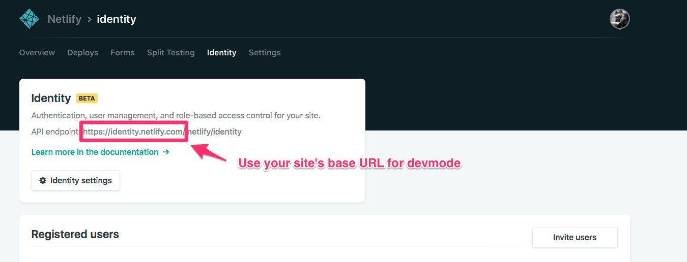

# Netlify Identity Widget

A component used to authenticate with Netlify's Identity service.
[Live demo](https://identity.netlify.com)

For usage example with React and React Router, please see our `/example` folder and [read the README](https://github.com/netlify/netlify-identity-widget/tree/master/example).

## What is Netlify Identity

Netlify’s Identity service is a plug-and-play microservice for handling site
functionalities like signups, logins, password recovery, user metadata, and
roles. You can use it from single page apps instead of rolling your own, and
integrate with any service that understands JSON Web Tokens (JWTs).

Learn more about this service from this
[blog post](https://www.netlify.com/blog/2017/09/07/introducing-built-in-identity-service-to-streamline-user-management/).

## Usage

Simply include the widget on your site, and things like invites, confirmation
codes, etc, will start working.

You can add controls for the widget with HTML:

```html
<!DOCTYPE html>
<html>
<head>
  <title>A static website</title>

  <!-- include the widget -->
  <script type="text/javascript" src="https://identity.netlify.com/v1/netlify-identity-widget.js"></script>
</head>
<body>
  <!-- Add a menu:
   Log in / Sign up - when the user is not logged in
   Username / Log out - when the user is logged in
  -->
  <div data-netlify-identity-menu></div>

  <!-- Add a simpler button:
    Simple button that will open the modal.
  -->
  <div data-netlify-identity-button>Login with Netlify Identity</div>
</body>
</html>
```

The widget will automatically attach itself to the window object as
`window.netlifyIdentity`.

You can use this global object like this:

```js
// Open the modal
netlifyIdentity.open();

// Get the current user:
const user = netlifyIdentity.currentUser();

// Bind to events
netlifyIdentity.on('init', user => console.log('init', user));
netlifyIdentity.on('login', user => console.log('login', user));
netlifyIdentity.on('logout', () => console.log('Logged out'));
netlifyIdentity.on('error', err => console.error('Error', err));
netlifyIdentity.on('open', () => console.log('Widget opened'));
netlifyIdentity.on('close', () => console.log('Widget closed'));

// Close the modal
netlifyIdentity.close();

// Log out the user
netlifyIdentity.logout();
// refresh the user's JWT 
// Note: this method returns a promise.
netlifyIdentity.refresh().then((jwt)=>console.log(jwt))

// Change language
netlifyIdentity.setLocale('en');
```

#### A note on script tag versioning

The `v1` in the above URL is not pinned to the major version of the module API,
and will only reflect breaking changes in the markup API.

### Module API

Netlify Identity Widget also has a
[module API](https://www.npmjs.com/package/netlify-identity-widget):

```
yarn add netlify-identity-widget
```

Import or require as usual:

```js
const netlifyIdentity = require('netlify-identity-widget');

netlifyIdentity.init({
  container: '#netlify-modal' // defaults to document.body,
});

netlifyIdentity.open(); // open the modal
netlifyIdentity.open('login'); // open the modal to the login tab
netlifyIdentity.open('signup'); // open the modal to the signup tab

netlifyIdentity.on('init', user => console.log('init', user));
netlifyIdentity.on('login', user => console.log('login', user));
netlifyIdentity.on('logout', () => console.log('Logged out'));
netlifyIdentity.on('error', err => console.error('Error', err));
netlifyIdentity.on('open', () => console.log('Widget opened'));
netlifyIdentity.on('close', () => console.log('Widget closed'));

// Close the modal
netlifyIdentity.close();

// Log out the user
netlifyIdentity.logout();

// refresh the user's JWT 
// Note: this method returns a promise.
netlifyIdentity.refresh().then((jwt)=>console.log(jwt))

// Change language
netlifyIdentity.setLocale('en');

// Access the underlying GoTrue JS client.
// Note that doing things directly through the GoTrue client brings a risk of getting out of
// sync between your state and the widget’s state.
netlifyIdentity.gotrue;
```

#### `netlifyIdentity.init([opts])`

You can pass an optional `opts` object to configure the widget when using the
module API. Options include:

```js
{
  container: '#some-query-selector'; // container to attach to
  APIUrl: 'https://www.example.com/.netlify/functions/identity'; // Absolute url to endpoint.  ONLY USE IN SPECIAL CASES!
  namePlaceholder: 'some-placeholder-for-Name'; // custom placeholder for name input form
  locale: 'en'; // language code for translations - available: en, fr - default to en
}
```

Generally avoid setting the `APIUrl`. You should only set this when your app is
served from a domain that differs from where the identity endpoint is served.
This is common for Cordova or Electron apps where you host from localhost or a
file.

## Localhost

When using the widget on localhost, it will prompt for your Netlify SiteURL the
first time it is opened. Entering the siteURL populates the browser's
localStorage.

This allows the widget to know which instance of Netlify Identity it should
communicate with zero configuration.

E.g. If your Netlify site is served from the `olddvdscreensaver.com` domain
name, enter the following when prompted by the widget when in development mode:

```
https://olddvdscreensaver.com
```




## List of Alternatives

**Lowest level JS Library**: If you want to use the official Javascript bindings to GoTrue, Netlify's underlying Identity service written in Go, use https://github.com/netlify/gotrue-js

**React bindings**: If you want a thin wrapper over Gotrue-js for React, `react-netlify-identity` is a "headless" library, meaning there is no UI exported and you will write your own UI to work with the authentication. https://github.com/sw-yx/react-netlify-identity

**High level overlay**: If you want a "widget" overlay that gives you a nice UI out of the box, with a somewhat larger bundle, check https://github.com/netlify/netlify-identity-widget

**High level popup**: If you want a popup window approach also with a nice UI out of the box, and don't mind the popup flow, check https://github.com/netlify/netlify-auth-providers

You can also see an example of wrapping netlify-identity-widget in a React Hook here: https://github.com/sw-yx/netlify-fauna-todo/blob/master/src/hooks/useNetlifyIdentity.js

## FAQ

* Typescript Typings are maintained by @nkprince007 ([see PR](https://github.com/DefinitelyTyped/DefinitelyTyped/pull/30689)): `npm install @types/netlify-identity-widget` and then `import * as NetlifyIdentityWidget from "netlify-identity-widget"` (or `import NetlifyIdentityWidget from "netlify-identity-widget"` if you have `--allowSyntheticDefaultImports` on)

* If you experience a 404 while testing the Netlify Identity Widget on a local
  environment, you can manually remove the netlifySiteURL from localStorage by
  doing the following in the console.

```js
localStorage.removeItem('netlifySiteURL');
```

* See the `example` for how to integrate this widget with a react app.
